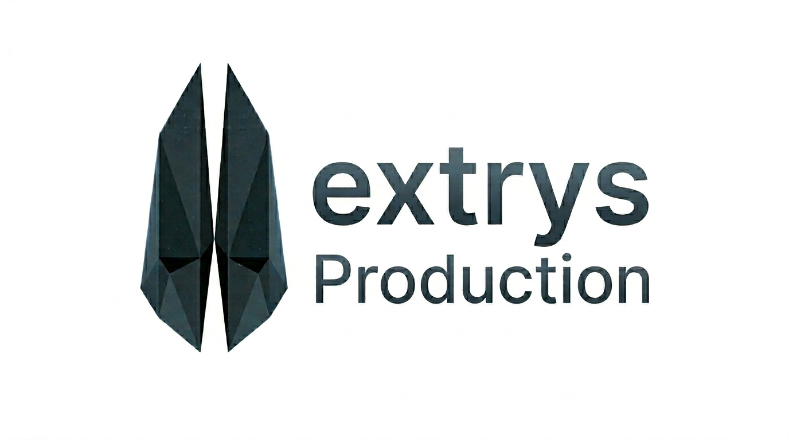

  

# Vextrys Crypto Wallet 

> **Official Repository of the Vextrys Project.**  
> *Established: March 25, 2026.*

---

## About the Project
**Vextrys** is a next-generation non-custodial crypto wallet designed for security, speed, and a seamless user experience. We aim to remove the complexity of blockchain interactions for everyday users.

### Key Innovation: Universal Gas Solution
One of our core features is the **Vextrys Native Gas-Token**. 
* **The Problem:** Users often struggle to maintain multiple native coins (TRX, ETH, BNB) just to pay for transaction fees.
* **Our Solution:** Pay for gas in any supported network using our internal ecosystem token. No more hunting for "dust" to send a transaction.

---

## Features & Roadmap

### Supported Networks
- [x] **Tron (TRC-20)** — *Full Integration (Current Focus)*
- [ ] **Ethereum (ERC-20)** — *Planned Q3 2026*
- [ ] **Binance Smart Chain (BEP-20)** — *Planned Q4 2026*

### Development Roadmap
*   **Phase 1: Foundation (Current)**
    *   [x] Branding & Visual Identity
    *   [x] Core Non-Custodial Architecture
    *   [ ] Private Alpha Testing (In Progress)
*   **Phase 2: Ecosystem**
    *   [ ] Native Gas-Token Smart Contract Launch
    *   [ ] Multi-chain Asset Support
*   **Phase 3: Public Launch**
    *   [ ] Security Audit by Tier-1 Firms
    *   [ ] Beta Release on iOS & Android

---

## Intellectual Property Notice
The name **Vextrys**, the conceptual design, and the underlying architecture are the intellectual property of the author.  
All rights reserved © 2026.

- **Status:** Development (Private Alpha)
- **Official Telegram:** [t.me/Vextrys](https://t.me)
- **Official X (Twitter):** [@VextrysWallet](https://x.com)
- **Release Date:** To be announced

---

> [!IMPORTANT]
> **Security Note:** The source code is currently hosted in a private repository for security reasons during the initial build and audit phase. Public release of selected modules is expected after the first security audit.

---

  Built by Vextrys Production

